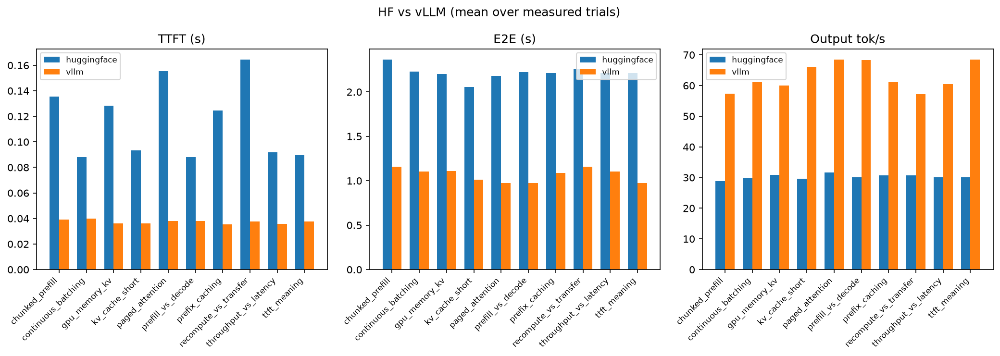
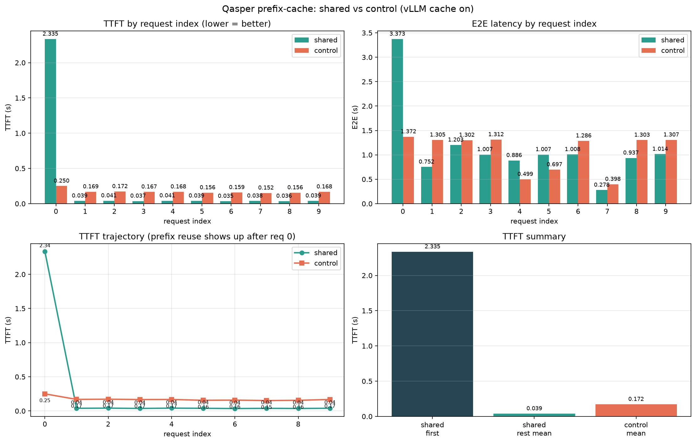
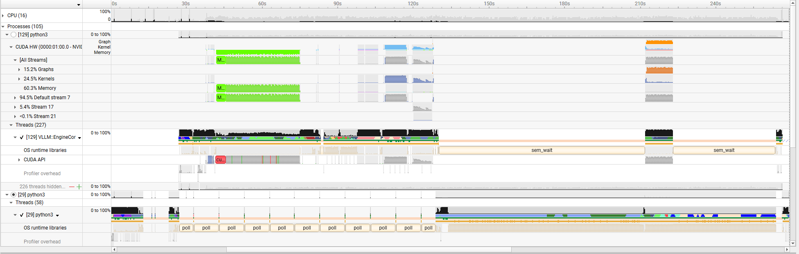
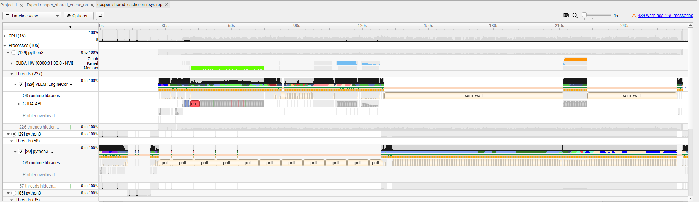
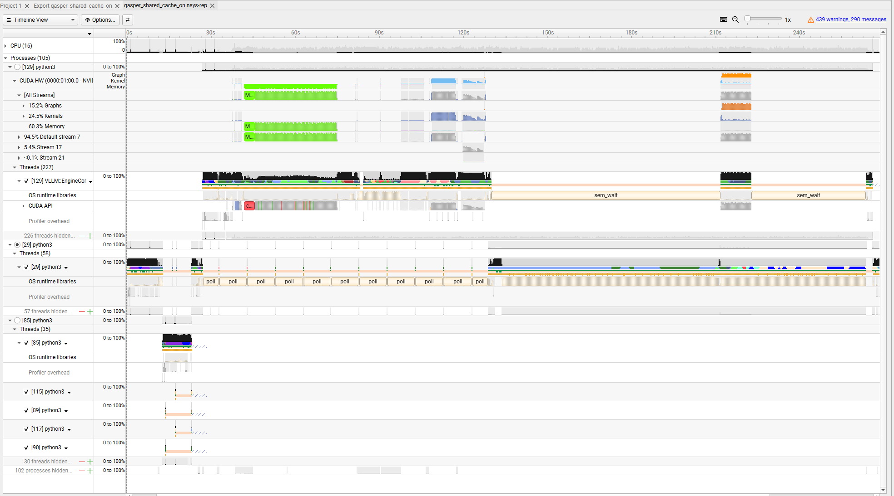
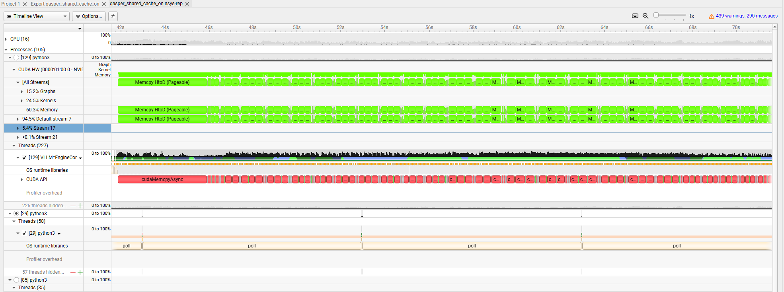
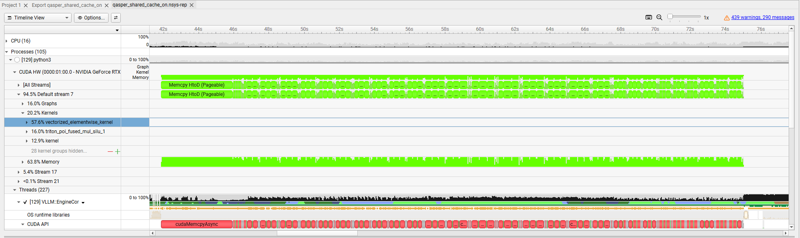
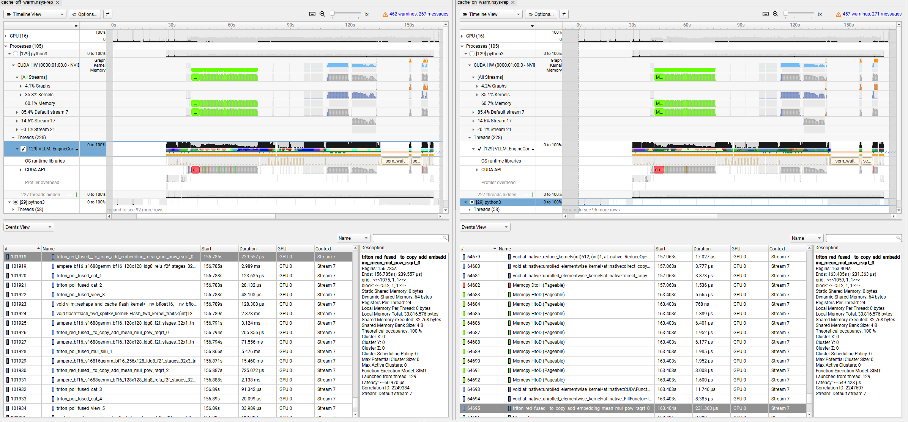
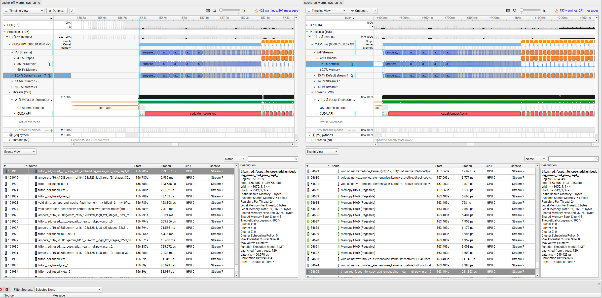

# LLM Inference Runtime Lab

A hands-on exploration of modern LLM inference systems, benchmarking, profiling, and runtime optimization.

The goal of this project is to understand how different inference engines execute transformer models, identify performance bottlenecks, and evaluate techniques such as shared-prefix caching, KV-cache management, and continuous batching.

This project is being built incrementally. Each phase introduces a new inference system concept and benchmarks it before moving on to more advanced runtime optimizations.

---

## Project Roadmap

* [x] **Phase 1** — Hugging Face baseline
* [x] **Phase 2** — vLLM baseline (Docker)
* [x] **Phase 3** — Benchmark framework
* [x] **Phase 4** — Shared-prefix workload generation (Qasper)
* [x] **Phase 5** — vLLM automatic prefix caching (shared vs control)
* [x] **Phase 6** — Profiling literacy (Nsight Systems) — *learning first*
* [ ] Phase 7 — LMCache integration
* [ ] Phase 8 — SGLang comparison
* [ ] Phase 9 — TensorRT-LLM comparison
* [ ] Phase 10 — AMD ROCm experiments
* [ ] Phase 11 — Deeper profiling (Nsight Compute / PyTorch Profiler)

---

# Current Progress

## Phase 1 — Hugging Face Baseline

* Load `Qwen/Qwen2.5-1.5B-Instruct` with Transformers
* Stream one generation; measure load time, TTFT, E2E, output tok/s
* Script: `hf_baseline.py` (`run_once()` used by the harness)

## Phase 2 — vLLM Baseline

* Serve the same model via Docker image `llm-lab-vllm:phase2`
* Stream OpenAI-compatible chat completions from the host
* Script: `vllm_baseline.py` (`run_once()` used by the harness)

## Phase 3 — Benchmark Framework

* 10 short prompts in `prompts/short.json`
* `run_benchmark.py` — choose engine, warmup, N trials, one JSONL
* `summarize.py` — mean / p50 / p90 / p95 / p99 (skips warmup)
* `plot_compare.py` — HF vs vLLM bar charts

### Phase 3 Results (laptop, RTX 4060)

**Config**

* Model: `Qwen/Qwen2.5-1.5B-Instruct`
* Prompts: `prompts/short.json` (10 questions)
* `max_new_tokens=64`, temperature 0
* Warmup: 1 per prompt (excluded from stats)
* Measured trials: 5 per prompt → **50 measured requests per engine**
* Hardware: NVIDIA RTX 4060 Laptop (~8 GB), Windows host + vLLM in Docker

**Artifacts**

| File | Description |
|------|-------------|
| `results/bench_vllm_20260728_191524.jsonl` | Raw vLLM trials |
| `results/bench_hf_20260728_191640.jsonl` | Raw HF trials |
| `results/bench_vllm_20260728_191524.summary.json` | Percentile summary |
| `results/bench_hf_20260728_191640.summary.json` | Percentile summary |
| `results/compare_hf_vllm.png` | Side-by-side mean bars (TTFT / E2E / tok/s) |

#### Comparison plot



Regenerate the plot:

```powershell
python plot_compare.py `
  results\bench_hf_20260728_191640.jsonl `
  results\bench_vllm_20260728_191524.jsonl `
  --out results\compare_hf_vllm.png
```

#### Aggregate (mean of per-prompt means)

| Engine | TTFT (s) | E2E (s) | Output tok/s |
|--------|----------|---------|--------------|
| Hugging Face | 0.116 | 2.21 | 30.2 |
| vLLM | **0.037** | **1.06** | **62.8** |
| Speedup (HF → vLLM) | ~3.1× | ~2.1× | ~2.1× |

#### One prompt detail — `kv_cache_short` (mean, n=5)

| Engine | TTFT (s) | E2E (s) | Output tok/s |
|--------|----------|---------|--------------|
| Hugging Face | 0.094 | 2.05 | 29.6 |
| vLLM | 0.036 | 1.01 | 65.9 |

#### Sample percentile lines (vLLM `ttft_meaning`, n=5)

```text
ttft_s             mean=0.0375  p50=0.0378  p90=0.0396  p95=0.0399  p99=0.0402
e2e_s              mean=0.9721  p50=0.9725  p90=0.9743  p95=0.9747  p99=0.9750
output_tok_per_s   mean=68.48   p50=68.53   p90=68.77   p95=68.82   p99=68.87
```

**Takeaways**

* On short prompts, warm vLLM is clearly faster than naive HF `generate` on this laptop.
* Decode throughput roughly **doubles**; TTFT drops by about **3×**.
* Per-prompt variance is small for TTFT on vLLM (~35–40 ms means); HF TTFT spans ~88–165 ms depending on the prompt.
* These are development-scale numbers (8 GB laptop, short contexts) — not datacenter claims.
* First-request cold start is excluded via warmup; always compare warm measured trials.

## Phase 4 — Shared-prefix workload (Qasper)

* `prepare_qasper_workload.py` builds a fixed, reproducible fixture from **allenai/qasper**
* Tokenizer: `Qwen/Qwen2.5-1.5B-Instruct`
* Paper truncated to **1024** tokens; `NUM_PROMPTS = 10`; `max_new_tokens = 64`
* Prompt template: paper context → question → `Answer:`

| File | Role |
|------|------|
| `prompts/qasper_shared_1024.json` | Same 1024-token paper + 10 different questions (reusable prefix) |
| `prompts/qasper_control_1024.json` | 10 different papers × 1 question each (no shared prefix) |

Regenerate:

```powershell
python prepare_qasper_workload.py
```

## Phase 5 — vLLM prefix caching

* Same harness (`run_benchmark.py`) against vLLM with automatic prefix caching enabled
* Compared **shared** vs **control** Qasper fixtures (one measured trial per prompt in the recorded run)
* `plot_qasper_prefix.py` — per-request TTFT/E2E bars, trajectory, and first-vs-rest summary

**Artifacts**

| File | Description |
|------|-------------|
| `results/qasper_shared_cache_on.jsonl` | Shared-prefix run (local; gitignored raw JSONL) |
| `results/qasper_control_cache_on.jsonl` | Control run (local; gitignored raw JSONL) |
| `results/qasper_prefix_compare.png` | Shared vs control TTFT / E2E plot |

### Prefix-cache plot



```powershell
python plot_qasper_prefix.py `
  --shared results\qasper_shared_cache_on.jsonl `
  --control results\qasper_control_cache_on.jsonl `
  --out results\qasper_prefix_compare.png
```

### Headline numbers (this machine, cache on)

| Slice | TTFT (s) |
|-------|----------|
| Shared — first request (cold prefix) | **2.335** |
| Shared — mean of requests 1–9 (warm prefix) | **0.039** |
| Control — mean across 10 requests | **0.172** |

**Takeaways**

* After the first shared request fills the prefix KV cache, later shared questions hit ~**0.04 s** TTFT.
* Control stays ~**0.15–0.25 s** TTFT — every prompt has a unique long paper prefix.
* Warm shared TTFT is roughly **4×** lower than control mean, and ~**60×** lower than the shared cold first request.
* E2E still includes decode; TTFT is the clearest prefix-cache signal on this fixture.

---

## Phase 6 — Nsight Systems profiling (learning first)

**Goal:** stop treating vLLM as a black box. Use NVIDIA Nsight Systems to see CPU and GPU activity during inference, then compare prefix caching **on** vs **off** under a fair warm protocol.

Built `llm-lab-vllm:profile` (`docker/Dockerfile.profile`) — the usual vLLM image plus Nsight Systems CLI. Trace files (`.nsys-rep`) stay local under `profiling/reports/` (gitignored). Screenshots live in `profiling/screenshots/`.

---

### First day — learning to read the timeline

At first, every Nsight view looked the same: green memory bars, red CUDA API, dense kernels. Without a controlled experiment it was hard to tell *what* mattered.

What we learned to read (left → right is time; a vertical slice is “everything at one instant”):

```text
Python (vLLM)  →  CUDA Runtime API (CPU)  →  GPU (memcpy / graphs / kernels)
```

| Timeline row | What it is |
|--------------|------------|
| EngineCore | vLLM’s main engine thread (schedules work; sits in `sem_wait` when idle) |
| CUDA Runtime API | CPU calls such as `cudaMemcpyAsync` — instructions, not GPU math |
| CUDA HW / streams | What the GPU actually runs (mostly default stream in our captures) |
| Memcpy HtoD | Host RAM → GPU memory |
| Kernels | Real compute (many small kernels per layer, including Triton) |

These five screenshots are from that **first** exploratory session (one long shared-prefix server capture). They are only here to show “what the UI looks like,” not to prove cache on vs off.

Overview — activity comes in bursts; long gaps are the server idle:



Same idea, EngineCore lined up with GPU work:



Wider detail — streams and CUDA API:



Zoom — CPU `cudaMemcpyAsync` lined up with GPU `Memcpy HtoD`:



Kernels expanded — e.g. elementwise and Triton fused ops, not one big “transformer” kernel:



---

### Then — a reproducible capture script

`scripts/profile_prefix_cache.py` runs the full loop:

1. Start the profile image under `nsys`
2. Wait until `GET /health` succeeds
3. Send one **unrelated** short prompt (warms the GPU without putting the paper into the prefix cache)
4. Send **two** Qasper prompts that share the same paper (question 1, then question 2)
5. `docker stop` so Nsight finishes writing the report

Prefix caching is **on by default** in this vLLM version. For the off case the script passes `--no-enable-prefix-caching`.

```powershell
python scripts\profile_prefix_cache.py --cache on  --output cache_on_warm
python scripts\profile_prefix_cache.py --cache off --output cache_off_warm
```

---

### Controlled comparison — cache off vs cache on (after warmup)

Same recipe both times: unrelated warmup → shared paper Q1 → shared paper Q2.  
At a glance the two timelines still look alike. The difference shows up when you open **Events** around a request and look at memcpy size and what runs next.

**Zoomed out** — left: cache off, right: cache on. Broad shape is similar (long init, then request bursts):



**Zoomed in (Events)** — left: cache off (mostly kernels in the window). Right: cache on — a run of **very small** Host→Device copies, then the usual transformer kernels:



**What that means**

* A prefix-cache **hit** does **not** copy the big shared KV tensors back to the GPU.
* That KV already lives in GPU memory from the first request.
* The tiny H→D copies are consistent with **request metadata** (things like paged-attention block tables / maps), so the GPU can **reuse** resident KV. We cannot prove each copy is specifically a block-table update from the timeline alone — only that they are metadata-sized, not a bulk KV transfer.
* Client-side TTFT still drops on the second shared-prefix question when caching is on; when it is off, the second question still re-prefills more of the paper (warm GPU, but no prefix reuse).

| | Cache off | Cache on |
|--|-----------|----------|
| Shared paper on Q2 | largely recomputed | reuse KV already on the GPU |
| Small H→D burst before kernels | not the same pattern | present |
| Second-question TTFT | higher | lower |

---

### Dashboard (GitHub Pages)

Static comparison page built from `nsys stats` CSVs **plus** filtered queries on the local Nsight `.sqlite` exports:

* Live: [APC Nsight A/B dashboard](https://sudhersankv.github.io/gpu-programming/)
* Source: repo-root `docs/` (`index.html`, `data.json`, screenshots)
* CSVs: `profiling/stats/`
* SQLite (local only, gitignored): `profiling/reports/*.sqlite` → `scripts/query_nsys_sqlite.py`

Rebuild after new traces:

```powershell
python scripts\export_nsys_stats.py
python scripts\build_apc_dashboard_data.py
python scripts\query_nsys_sqlite.py
```

Enable Pages once: repo **Settings → Pages → Deploy from branch → `/docs`**.

### Phase 6 status

Done for this lab: learn Nsight → automate capture → fair warm on/off comparison → metadata vs KV conclusion → static dashboard.

Optional later: NVTX labels per request, keep bench JSONL next to reports, Nsight Compute, PyTorch Profiler on Hugging Face.

---

# Environment

* Windows 11 + Docker Desktop (WSL2 / Linux engine)
* Python 3.12 (host venv for clients)
* NVIDIA RTX 4060 Laptop GPU (~8 GB)
* CUDA-enabled PyTorch + Hugging Face Transformers
* vLLM in Docker (`llm-lab-vllm:phase2`, profiling image `llm-lab-vllm:profile`)
* Nsight Systems CLI inside the profile image; GUI on the Windows host

---

# Getting Started

## Host client

```powershell
python -m venv .venv
.\.venv\Scripts\Activate.ps1
python -m pip install -U pip
pip install torch torchvision torchaudio --index-url https://download.pytorch.org/whl/cu124
pip install -r requirements.txt
```

## Single-shot baselines

```powershell
python hf_baseline.py
# with vLLM server running:
python vllm_baseline.py
```

## Repeatable benchmark (Phase 3)

Start vLLM (for `--engine vllm`):

```powershell
docker run --rm -it --gpus all --ipc=host -p 8000:8000 `
  -v ${env:USERPROFILE}\.cache\huggingface:/root/.cache/huggingface `
  llm-lab-vllm:phase2
```

Run harness (10 prompts × warmup × trials):

```powershell
# vLLM first (server must be up) — faster smoke of the harness
python run_benchmark.py --engine vllm --warmup 1 --trials 5 --prompts prompts/short.json

# Hugging Face (loads model once, then all prompts)
python run_benchmark.py --engine hf --warmup 1 --trials 5 --prompts prompts/short.json
```

Summarize and plot:

```powershell
python summarize.py results/bench_vllm_YYYYMMDD_HHMMSS.jsonl
python summarize.py results/bench_hf_YYYYMMDD_HHMMSS.jsonl

python plot_compare.py results/bench_hf_....jsonl results/bench_vllm_....jsonl `
  --out results/compare_hf_vllm.png
```

Example (this machine’s Phase 3 run):

```powershell
python summarize.py results\bench_vllm_20260728_191524.jsonl
python summarize.py results\bench_hf_20260728_191640.jsonl
python plot_compare.py results\bench_hf_20260728_191640.jsonl results\bench_vllm_20260728_191524.jsonl
```

Defaults: `--warmup 1`, `--trials 5`, `--max-new-tokens 64`.

## Qasper prefix-cache bench (Phases 4–5)

```powershell
python prepare_qasper_workload.py

python run_benchmark.py --engine vllm --warmup 0 --trials 1 `
  --prompts prompts/qasper_shared_1024.json

python run_benchmark.py --engine vllm --warmup 0 --trials 1 `
  --prompts prompts/qasper_control_1024.json

# rename/copy JSONLs to the names plot_qasper_prefix.py expects, then:
python plot_qasper_prefix.py
```

---

# Prompt sets

`prompts/short.json` — 10 inference-systems questions (similar length, fixed `max_new_tokens=64`):

* kv_cache_short, prefill_vs_decode, paged_attention, ttft_meaning
* continuous_batching, prefix_caching, gpu_memory_kv
* throughput_vs_latency, chunked_prefill, recompute_vs_transfer

`prompts/qasper_*_1024.json` — long-context shared-prefix vs control fixtures (Phase 4).

---

# Future Work

* Optional Phase 6.1: NVTX per request, persist bench JSONL with reports, Nsight Compute, PyTorch Profiler
* Prompt-length sweeps (512 / 2048 token fixtures)
* Concurrency sweeps
* LMCache
* SGLang / TensorRT-LLM / ROCm

Each phase will introduce one new systems concept while keeping the benchmark methodology consistent.
